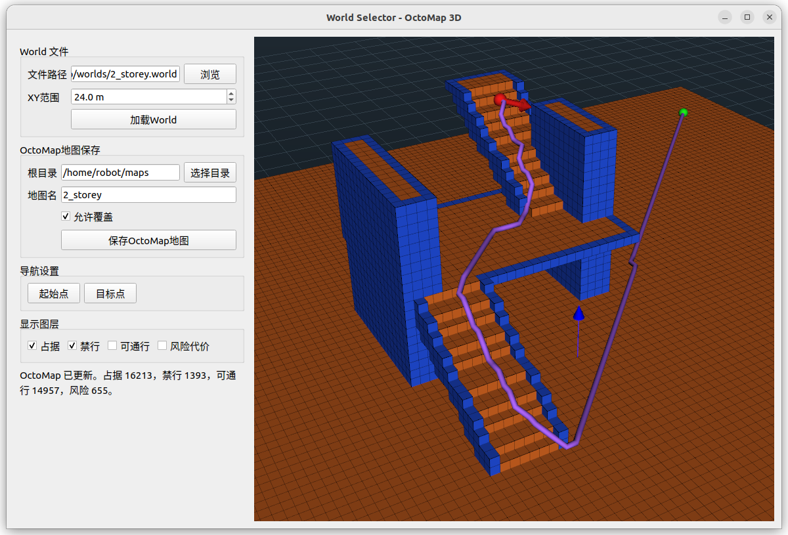

# jie_3d_nav

[中文](./README.md)

A ROS 2 Humble based 3D navigation system with a Web interface. This system has been tested on the AgiBot D1 quadruped robot and the LiuxingTech Odin 1 spatial localization module.

<p align="center">
  
</p>

This directory contains three ROS 2 packages:

- `jie_map_msgs`: custom service interfaces for saving, loading, and exporting navigation map packages.
- `jie_octomap`: OctoMap management package for importing maps in multiple formats, saving/loading map packages, OctoMap visualization, and map editing.
- `octo_planner`: OctoMap based 3D path planning, path tracking control, Web test launch files, and navigation launch files.

## Features

- Import PCD point cloud maps as OctoMap.
- Import ROS 2D occupancy grid maps as 3D OctoMap.
- Convert Gazebo `.world` / `.sdf` scenes to OctoMap.
- Save and load OctoMap map packages.
- View and edit OctoMap cells with a Qt/VTK GUI.
- View OctoMap in a Web page, select start/goal points, and run path planning.
- Provide a navigation entry for the AgiBot D1 robot equipped with the LiuxingTech Odin 1 module, plus a standalone Web test entry.

## Introduction Video

- Bilibili: [Open Source ROS 2 Based 3D Navigation System](https://www.bilibili.com/video/BV1jgR9BmELw)
- YouTube: [Open Source ROS 2 Based 3D Navigation System](https://www.youtube.com/watch?v=CepO90mzIeI)

## Directory Layout

```text
jie_3d_nav/
├── jie_map_msgs/        # Custom srv interfaces
├── jie_octomap/         # OctoMap import, management, editing, Web/GUI tools
├── octo_planner/        # 3D planner, controller, navigation launch files
├── jie_octomap/worlds/  # Example Gazebo worlds
└── install_deps_humble.sh
```

## Requirements

- Ubuntu 22.04
- ROS 2 Humble
- `colcon`
- OctoMap / octomap_msgs
- OpenCV
- Open3D C++ development files
- PyQt5, VTK, NumPy, Pillow, PyYAML
- Optional: `rosbridge_server`, used by the Web page to access ROS through websocket

### ROS 2 Foxy Reproduction Notes

This project primarily targets Ubuntu 22.04 / ROS 2 Humble. Ubuntu 20.04 / ROS 2 Foxy can be used to validate the core pipeline, including Gazebo world or PCD map import into OctoMap and 3D path planning, with a few extra environment details:

- Install the Foxy Python point cloud helper package: `sudo apt-get install ros-foxy-sensor-msgs-py`.
- Ubuntu 20.04 commonly provides `python3-vtk7`, whose Qt entry point is `vtk.qt.QVTKRenderWindowInteractor`; newer VTK versions use `vtkmodules.qt.QVTKRenderWindowInteractor`.
- If Open3D C++ is installed outside the system search paths, pass `Open3D_DIR` or `CMAKE_PREFIX_PATH` so CMake can find `Open3DConfig.cmake`.
- If `pcd_to_octomap_node` fails with `libtbb.so.12: cannot open shared object file`, add the Open3D installation `lib/` directory to the runtime library path, for example:

```bash
export LD_LIBRARY_PATH=/path/to/open3d_install/lib:${LD_LIBRARY_PATH}
```

The base build does not require these two packages:

- `d1_bringup`
- `d1_description`

Note: the full AgiBot D1 navigation entry `octo_planner/launch/nav.launch.py` still uses `d1_bringup` and `d1_description` at runtime because it starts `d1_core` and reads the AgiBot D1 URDF.

## Install Dependencies

Use the helper script:

```bash
cd ~/ros2_ws/src/jie_3d_nav
bash install_deps_humble.sh
```

If CMake cannot find Open3D, install the Open3D C++ development files and make sure `Open3DConfig.cmake` is visible through `Open3D_DIR` or `CMAKE_PREFIX_PATH`.

## Build

Build from the ROS 2 workspace root. Do not run `colcon build` directly inside the source package directory `src/jie_3d_nav`; doing so creates extra `build/`, `install/`, and `log/` directories in the source tree:

```bash
cd ~/ros2_ws
source /opt/ros/humble/setup.bash
colcon build --packages-select jie_map_msgs jie_octomap octo_planner
source install/setup.bash
```

If Open3D C++ is not in the default CMake search path:

```bash
colcon build --packages-select jie_map_msgs jie_octomap octo_planner \
  --cmake-args -DOpen3D_DIR=/path/to/open3d_install/lib/cmake/Open3D
```

If the source directory has been moved, old CMake cache may still point to an old path. Clean the cache and rebuild:

```bash
colcon build --packages-select jie_map_msgs jie_octomap octo_planner --cmake-clean-cache
```

If you accidentally built inside the source package directory, remove the ignored temporary outputs from that source directory:

```bash
rm -rf build install log
```

## Quick Start

Run the following command to load an example map:

```bash
ros2 launch jie_octomap import_gazebo_world.launch.py world_name:=2_storey.world
```

In the popup window, load the Gazebo world file, set the map crop side length, and click the load button to convert the world file into an OctoMap and display it in the window.

<p align="center">
  
</p>

Click the "Start" button first, then click on the map to set the start position. Click the "Goal" button, then click on the map to set the goal position. A feasible path will be planned.

<p align="center">
  
</p>

## Map Import

### Import a PCD Point Cloud Map

```bash
ros2 launch jie_octomap import_pcd_map.launch.py
```

This launch starts:

- `pcd_to_octomap_node`
- `octomap_to_occupied_markers_node`
- `map_package_manager`
- `pcd_map_import_gui`
- `octo_planner/jie_path_node`

`pcd_map_import_gui` previews the loaded PCD on the left and provides common cleanup tools before conversion:

- `Recommend conversion parameters`: estimate point spacing, point count, and map extent from the current working cloud, then fill in the OctoMap resolution, minimum points per voxel, and minimum connected voxel count.
- `Preprocess downsample (m)`: voxel-downsample the GUI working cloud when reading the PCD. If this value is changed, select/read the PCD again to apply it to the current cloud.
- `Enable selection cube`: show a movable selection cube. Use `W/S`, `A/D`, and `Q/E` to move along X/Y/Z.
- `Erase points inside cube`: remove points inside the cube.
- `Keep points inside cube`: keep only points inside the cube and remove outside points. This is useful for cropping a large global point cloud before OctoMap conversion.

For sparse or large PCD maps, click `Recommend conversion parameters` before converting to OctoMap. After conversion, check `kept_voxels` and `occupied_voxels` in the terminal logs:

- If `kept_voxels` is only dozens or hundreds, the resolution is usually too fine, or the minimum points per voxel is too high.
- If `kept_voxels` is very large, the resolution is usually too fine or the crop area is too large. Qt/Web display and planning may become slow.
- For sparse point clouds, a practical starting point is `min_points_per_voxel=1` and `min_cluster_voxels=1`.

After a successful conversion, the terminal should show logs similar to:

```text
Loaded PCD file: ... source_points=... kept_voxels=... occupied_voxels=...
Preprocess mask rebuilt...
Preblocked costmap rebuilt...
```

When saving a map package, the GUI defaults to the current user's `~/maps` directory. If you choose a custom save root, make sure the current user can write to it. Avoid `/home/robot/maps` unless you are actually running in that robot account/environment.

If the GUI does not show the converted OctoMap on the right side, or saving the map package reports `not ready` / `octomap not ready`, first check whether `pcd_to_octomap_node` has exited. A common cause is that an Open3D runtime dependency is not visible to the dynamic linker, for example:

```text
error while loading shared libraries: libtbb.so.12: cannot open shared object file
```

Check the missing dependency with:

```bash
ldd install/jie_octomap/lib/jie_octomap/pcd_to_octomap_node | grep -E "not found|tbb"
```

If `libtbb.so.12` is not found, add the Open3D installation `lib/` directory to `LD_LIBRARY_PATH` and restart the launch:

```bash
export LD_LIBRARY_PATH=/path/to/open3d_install/lib:${LD_LIBRARY_PATH}
ros2 launch jie_octomap import_pcd_map.launch.py
```

You can also override the conversion defaults from the command line:

```bash
ros2 launch jie_octomap import_pcd_map.launch.py \
  resolution:=0.5 \
  voxel_downsample_m:=0.0 \
  min_points_per_voxel:=1 \
  min_cluster_voxels:=1
```

### Import a ROS 2D Occupancy Grid Map

```bash
ros2 launch jie_octomap import_ros_map.launch.py
```

This launch starts:

- `occupancy_grid_to_octomap_node`
- `octomap_to_occupied_markers_node`
- `map_package_manager`
- `ros_map_import_gui`
- `octo_planner/jie_path_node`

### Import a Gazebo World / SDF

For built-in example worlds, use `world_name`:

```bash
ros2 launch jie_octomap import_gazebo_world.launch.py world_name:=field.world
```

For an external world file, use an absolute path:

```bash
ros2 launch jie_octomap import_gazebo_world.launch.py world_file:=/absolute/path/to/map.world
```

If both `world_file` and `world_name` are provided, `world_file` takes precedence.

The `jie_octomap/worlds/` directory provides two example world files. They are installed with the `jie_octomap` package to `share/jie_octomap/worlds/`:

- `2_storey.world`: two-storey building/floor example.
- `field.world`: field example.

Load the two-storey example:

```bash
ros2 launch jie_octomap import_gazebo_world.launch.py world_name:=2_storey.world
```

Load the field example:

```bash
ros2 launch jie_octomap import_gazebo_world.launch.py world_name:=field.world
```

This launch starts:

- `world_to_octomap_node`
- `world_selector_gui.py`
- `map_package_manager`
- `octo_planner/jie_path_node`

## Map Management and Editing

Main entry for OctoMap management and editing:

```bash
ros2 launch jie_octomap map_manager.launch.py
```

This launch starts:

- `map_package_manager`
- `octomap_to_occupied_markers_node`
- `map_viewer_gui`
- Optional `octo_planner/jie_path_node`

`map_viewer_gui` supports:

- Open map packages.
- Refresh maps.
- Save maps.
- View occupied, preblocked, traversable, and risk-cost layers.
- Edit cells as `occupied`, `preblocked`, `traversable`, or `clear`.
- Select start points, goal points, and navigation targets.

## Web Visualization

### Load a Map and Start the Web Page

```bash
ros2 launch jie_octomap web_octomap.launch.py map_package:=~/maps/map
```

Common parameters:

- `map_package`: saved map package directory.
- `http_port`: static Web server port, default `8080`.
- `launch_rosbridge`: whether to start `rosbridge_websocket`.
- `launch_map_gui`: whether to also start the Qt save/load window.

If `8080` is already occupied, Python's HTTP server reports `OSError: [Errno 98] Address already in use`. This is a local port conflict, not a robot/IP issue. Use another port:

```bash
ros2 launch jie_octomap web_octomap.launch.py \
  map_package:=~/maps/map \
  http_port:=8081
```

If the Web page needs to communicate with ROS, start `rosbridge_websocket`:

```bash
ros2 launch jie_octomap web_octomap.launch.py \
  map_package:=~/maps/map \
  http_port:=8081 \
  launch_rosbridge:=true
```

If rosbridge is not installed:

```bash
sudo apt install ros-${ROS_DISTRO}-rosbridge-server
```

Open in a browser:

```text
http://localhost:8081
```

When accessing from another device, use the IP address of the machine running this launch, for example `http://<host-ip>:8081`. Use the robot IP only when the Web service is running on the robot.

### Web Function Test

```bash
ros2 launch octo_planner web_test.launch.py
```

`web_test.launch.py` is used to test Web access, map display, Web start/goal selection, path planning, and the basic control chain. This launch no longer depends on `d1_bringup` or `d1_description`; it uses a minimal `base_link` URDF for `robot_state_publisher`.

Before starting, configure:

```text
octo_planner/config/nav_params.yaml
```

At minimum, set:

- `relocalization_bin_file`: `.bin` map file used for relocalization.
- `map_package_dir`: saved OctoMap map package directory.

## Full Navigation on AgiBot D1

Full robot navigation entry:

```bash
ros2 launch octo_planner nav.launch.py
```

This launch is for real navigation on the AgiBot D1 robot, combined with the LiuxingTech Odin 1 spatial localization module. It starts or uses:

- `d1_bringup/d1_core`
- `d1_description/urdf/d1.urdf`
- `odin_ros_driver`
- `octo_planner/jie_path_node`
- `octo_planner/d1_controller`
- `jie_octomap/map_package_manager`
- Web viewer and `rosbridge_websocket`

Before running, update the environment-specific configuration:

```text
octo_planner/config/nav_params.yaml
```

Important fields:

- `relocalization_bin_file`
- `map_package_dir`
- `relocalization_pcd_file`
- `show_rviz`
- `show_map_gui`
- `publish_d1_odom`
- `use_static_odom_to_base`

Also check the LiuxingTech Odin 1 driver configuration:

```text
odin_ros_driver/config/control_command.yaml
```

Set `custom_map_mode` to `2`, meaning `Relocalization mode`.

In `octo_planner/config/nav_params.yaml`, at minimum configure:

- `relocalization_bin_file`: `.bin` map file used for relocalization.
- `map_package_dir`: saved OctoMap map package directory.

If RViz is needed to observe localization, also configure:

- `relocalization_pcd_file`: `.pcd` point cloud map file for RViz display.

## Other Launch Files

```bash
ros2 launch jie_octomap octomap_test.launch.py
ros2 launch jie_octomap octomap_open3d.launch.py
ros2 launch jie_octomap odin1_slam.launch.py
ros2 launch jie_octomap odin1_loc.launch.py
```

`odin1_slam.launch.py` and `odin1_loc.launch.py` are for LiuxingTech Odin 1 workflows. They require `odin_ros_driver` at runtime and can optionally use `odin_costmap` configuration.

## Recommended Starter Book

Robot Operating System ROS2: Introduction and Practice

<p align="center">
  
</p>

Taobao link: [Robot Operating System ROS2: Introduction and Practice](https://world.taobao.com/item/820988259242.htm)

## Follow The WeChat Official Account

Scan the QR code to follow the WeChat official account. More robotics, ROS 2, and embodied intelligence open-source projects will be shared later.

<p align="center">
  
</p>
